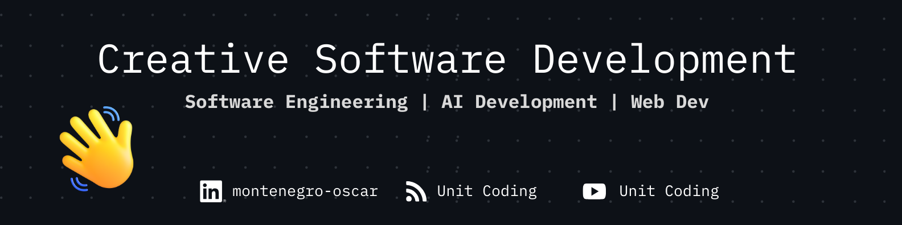

<h1 align="center">Hi, I'm Oscar Montenegro</h1>

✨ “I love crafting software that’s not only functional, but also clean, scalable, and creative. My main playground is .NET and Web APIs, where I’ve been solving problems for 7+ years. Lately, I’ve been diving into AI, experimenting with LLMs and Microsoft’s Semantic Kernel in .NET—pushing myself to blend software engineering fundamentals with the exciting new frontier of AI.” ✨

### ⚡ What I’m Up To
<blockquote>
 

- 🔭 I’m currently working on **Song Repertoire Manager**

- 🌱 I’m currently learning **Generative AI, LLMs and Semanti kernel**

- 👯 I’m looking to collaborate on **a cool markdown editor**

- 👨‍💻 All of my projects are available at [unitcoding.com](https://unitcoding.com)

- 📝 I regularly write articles on [unitcoding.com](https://unitcoding.com)

- 💬 Ask me about **.NET, React, Angular, HTML, CSS, Javascript, Typescript**

- 📫 How to reach me **osarosempu@gmail.com**

- 📄 Know about my experiences [linkedin/montenegro-oscar](https://www.linkedin.com/in/montenegro-oscar/) 
 
</blockquote>

### 💻 Languages

### 🧩 Frameworks

### 🛠️ Tools

<!-- <h3 align="center">My Stats</h3> -->

### 🏆 My Stats
<!-- 

 -->

  &nbsp;&nbsp;&nbsp; 